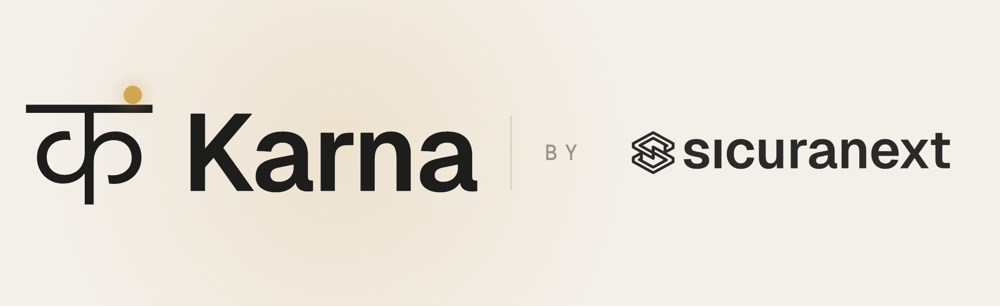

<p align="center">
  
</p>

<p align="center">
  <a href="https://github.com/sicuranext/karna/actions/workflows/ci.yml"></a>
  <a href="LICENSE"></a>
  <a href="https://discord.gg/FaHMZfmqty"></a>
</p>

<p align="center">
  <b>A WAF for Kong Gateway that blocks attacks 2-4x faster than ModSecurity.</b><br>
  Full OWASP Core Rule Set coverage, plus the operational fixes that make it
  deployable. Rules in SecLang or JSON, MCP-aware, native rate limiting.
</p>

## Why Karna

Operating it:

- Change rules at runtime through Kong's Admin API: add, remove, or
  edit them with no `kong reload` and no nginx restart. The config
  cache invalidates per plugin instance.
- Rules, limits, and policies live in the plugin schema, set per
  service or per route through the Admin API. No config files on disk.
- Attach Karna where you want it: a service, a route, a consumer, or
  globally. Detach it the same way.
- Write rules in SecLang (ModSecurity-compatible) for the CRS pack and
  exclusion plugins, or in JSON for inline custom rules. Pick per rule.

Beyond detection:

- Rate limiting is a rule action, so there's no second plugin to chain.
- Karna understands the Model Context Protocol (Streamable HTTP
  transport): it parses the JSON-RPC envelope, reassembles SSE, and
  evaluates rules per event.
- CRS exclusion plugins load straight from upstream. Drop a WordPress,
  Drupal, or Nextcloud pack on disk and enable it per route; Karna
  doesn't fork them.
- Karna reads `kong.ctx.shared` keys set by GeoIP, ASN, or user-agent
  plugins and exposes them as rule variables and audit log fields.

Few false positives:

When a CRS rule fires on benign input that looks like SQLi or XSS, a
proper name like `O'Brien`, an address like `Via dell'Orso, 5`, or any
string with syntax-breaking characters, Karna can strip those
characters in place and forward the request instead of returning 403.
The user isn't blocked, and the upstream never sees the unsafe input.
See [Sanitize, don't block](#sanitize-dont-block) below.

The Referer header is a common source of these false positives,
because it carries arbitrary user-navigated URLs full of
syntax-breaking characters. For it, Karna exposes extra views of the
request:

- `request.header.referer.{scheme,host,path,query}`, the Referer
  parsed as a URL, exposed component by component, plus the
  Referer's querystring flattened the same way request args are
  (`request.header.referer.query.<arg>`).
- `request.header_no_fp.value:<name>`, every request header
  *except* the headers most commonly responsible for false positives:
  Referer, User-Agent, Accept-*, Content-*, Sec-*, Authorization.

Both live in the per-request inspection table. You can read them from
`%{var}` template macros, and they appear in the audit log enrichment
block. You can't yet match them directly as a `conditions[].variables`
entry, only through macro substitution.

### How it differs from ModSecurity

| | Karna | ModSecurity 3 / libmodsec |
|---|---|---|
| Runtime | Kong / OpenResty / LuaJIT | Apache, nginx, IIS (libmodsec) |
| Rule reload | Live, per Admin API call | Service restart |
| Rule scope | Per service / route / consumer / global | Server / vhost / location |
| Configuration | Plugin schema (Admin API) | `*.conf` files on disk |
| FP mitigation | **`fix_matched_parts` action, sanitize-and-forward** | Block, log, or anomaly score |
| Rate limiting | Native rule action | Out of scope (needs another module) |
| MCP / SSE | First-class | Not supported |
| Rule language | SecLang **and** JSON | SecLang only |
| Action override | Schema-level (`rule_action_overrides`, `rule_response_overrides`) | `SecRuleUpdateActionById` config snippet |

## Performance

On identical hardware (Hetzner CCX, 2 vCPU each), OWASP CRS PL1, driven by
k6 at 20 virtual users, Karna outperforms the common open-source WAF
stacks at the job a WAF exists for: blocking attacks. Every WAF returns the
same HTTP status on every request, so the numbers compare throughput, not
leniency.

| Scenario (requests/s, higher is better) | Apache + ModSec2 | nginx + ModSec3 | Coraza (Caddy) | **Karna** |
|---|---:|---:|---:|---:|
| Blocking attacks | 852 | 1623 | 570 | **3326** |
| Mixed real-world traffic | 612 | 1270 | 337 | **1569** |
| API with embedded attacks | 190 | 688 | 184 | **815** |
| Benign throughput, no cache | 392 | 1139 | 319 | **1310** |

Karna leads every other stack on attack-blocking, mixed and API traffic,
and runs 2 to 11 times faster than OWASP Coraza (the Go WAF, on Caddy)
across the board. The one workload where it trails is multipart uploads,
where nginx's native C++ body parser edges it by 7%. Full per-WAF,
per-scenario results and methodology are in [BENCHMARKS.md](./BENCHMARKS.md).

## How it works

Karna inspects every request against a layered rule pipeline:

1. **Always-on validation gates**: method allow-list, path-character
   policy, header deny-list, content-type / charset allow-list. These run
   before any rule and apply unconditionally to any request that has
   Karna attached.
2. **Per-service rule controls** (`rules_request` of type rule-control):
   adjust, exclude, or rewrite loaded rules at request time. Includes the
   in-repo CRS-fix layer (`coreruleset_fix.lua`) that neutralises known
   false-positive-prone OWASP CRS rules in production deployments.
3. **Global rules** — one Redis-distributed, HMAC-signed rule pack
   evaluated on *every* service Karna is attached to, hot-reloaded within
   seconds of a publish, no `kong reload` and no per-service config.
   Publish with `scripts/karna-rules.py --type global-rules`; enable by
   setting `KARNA_REDIS_URL`. See the
   [docs](https://karna.sicuranext.com/docs/rules.html#global-rules).
4. **Per-service local rules** (`rules_request`): your own custom rules,
   each run in the phase named by its `phase` field (access or
   header_filter). Gated by `local_rules_enabled` (default `true`).
5. **OWASP CoreRuleSet** loaded from disk at `init_worker`. Gated by
   `coreruleset_enabled` (default `true`).

Detection-only or blocking is controlled by `engine_blocking_mode`
(default `false`, detection-only).

Karna is also **MCP-aware** (Model Context Protocol), request-side
detection and parsing of the JSON-RPC envelope, plus SSE response
reassembly with per-event rule evaluation on the Streamable HTTP
transport. See the `mcp_*` configuration fields below.

## OWASP CRS compatibility

Karna ships with full support for loading OWASP CRS 4.x as the
default rule pack. CRS 4.26.0 is what the regression suite tracks.

Karna is **100% compatible** with the OWASP Core Rule Set. On the
in-scope CRS regression suite (`engine_blocking_mode=true`,
production-default config) it passes every test at PL1 and PL2, and all
but a couple of documented residuals at PL3+:

| Paranoia level | Pass rate | Tests (cumulative) |
|---|---|---|
| PL1 | 100% | 2757 / 2757 |
| PL2 | 100% | 4071 / 4071 |
| PL3 | 99.9% | 4604 / 4608 |
| PL4 | 99.9% | 4670 / 4674 |

PL1 is the recommended production posture, and it's clean in both
directions: no missed detections and no false positives. Higher levels
pass too, but PL>1 trades detection breadth for false positives, which
is why CRS ships per-app
[exclusion plugins](#crs-plugins-wordpress-drupal-etc), so most
deployments run PL1.

The aim is to detect the attack class, not to reproduce every CRS rule
id. CRS is built for Apache + ModSecurity and leans on that runtime's
quirks (TX-side-effect variables, anomaly scoring as the blocking
decision, response-body inspection, `SecRuleUpdateTargetById` exception
files). Karna runs inside Kong / OpenResty, where some of that is handled
by nginx or by Karna's always-on validation gates instead. A malicious
request still gets blocked, but the audit log may carry a Karna-native
rule id (`method_allowed`, `uri_path_check_violation`, etc.) rather than the
exact `920xxx`. The out-of-scope families, each enumerated in `start.py`
with its reason:

- Response-side families (950-956) and anomaly scoring (949 / 959 / 980):
  Karna runs at request time and blocks on the first match, no
  response-body phase, no score accumulation.
- Protocol enforcement (920): covered by nginx and Karna's always-on
  gates (method / path / header / content-type / charset).
- Exception handling (999): done through per-route plugin config or local
  rules.
- A short list of documented per-test residuals: ModSec-only request
  shapes nginx rejects first, the HTTP-parameter-pollution meta-flag
  (921180, which needs a regex-named TX-collection selector and is itself
  false-positive-prone), and the nested-array parameter-name false
  positive at PL2+ (resolved with an exclusion plugin).

Karna fires on zero benign payloads in the PL1 suite. That comes from
explicit FP-suppression work: the XML-to-ARGS scope fix, multipart
duplicate-part handling, the `t:urlDecodeUni` `%2B` idempotency fix, and
untruncated `MATCHED_VARS`, each closing an FP class that stock
CRS-on-ModSec carries by default.

You can verify the numbers locally. The harness lives in
[`crs-regression-test/`](./crs-regression-test/) and is the code CI runs:

```sh
cd crs-regression-test
./fetch-tests.sh                # PL1 test set (CRS 4.26.0)
./configure-kong.sh             # configure Kong + Karna
python3 start.py --testfile tests/
# -> PL1 100% (2757/2757)

CRS_MAX_PL=4 ./fetch-tests.sh   # extend through PL4
PARANOIA=4 ./configure-kong.sh
python3 start.py --testfile tests/
# -> 100% (4674/4674)
```

`start.py` lists every rule and test Karna treats as removed,
out-of-scope, or a documented residual, each with a reason. Anything not
listed and still failing is a real gap, please open an issue.

## CRS plugins (WordPress, Drupal, etc.)

OWASP ships extra rule packs called CRS plugins. Each one adjusts the
Core Rule Set for a specific app (WordPress, Drupal, Nextcloud, phpBB,
and others), usually by switching off the rules that cause false
positives on that app.

Karna loads these plugins unchanged, the same way any other CRS setup
does. It doesn't ship with them, so download the ones you need first.

### 1. Download the plugins

The plugins live at [github.com/coreruleset](https://github.com/coreruleset),
one repo each. Clone the ones you want into a single directory. Karna
reads from `/opt/coreruleset-plugins/` by default.

```sh
mkdir -p /opt/coreruleset-plugins
cd /opt/coreruleset-plugins
git clone https://github.com/coreruleset/wordpress-rule-exclusions-plugin.git
```

Each plugin keeps its rules in a `plugins/` subdirectory:

```
/opt/coreruleset-plugins/
  wordpress-rule-exclusions-plugin/
    plugins/
      wordpress-rule-exclusions-before.conf
      wordpress-rule-exclusions-config.conf
```

If you run Karna in a container, clone the plugins into the image or
mount the directory as a volume.

### 2. Enable the plugin

Add the plugin's directory name to `crs_plugins_enabled`:

```json
{
  "name": "karna",
  "config": {
    "crs_plugins_path": "/opt/coreruleset-plugins/",
    "crs_plugins_enabled": ["wordpress-rule-exclusions-plugin"]
  }
}
```

Use the directory name, not a file path. The next request to that
service loads the plugin and applies its exclusions.

### Notes

- Plugins apply per service. Enable the WordPress plugin on the service
  in front of WordPress; your other services keep the full CRS.
- Karna reads the files once and caches them. After you change files on
  disk for an enabled plugin, re-save the Karna config or restart the
  worker to reload them.
- A name in `crs_plugins_enabled` that isn't on disk is ignored, not an
  error. You can list it before you clone it.
- Update a plugin with `git pull` in its directory.
- A plugin's own settings, if it has any, live in its `*-config.conf`
  file. Edit them there.

### Inline exclusions

For one or two small changes you don't need a plugin directory. Put the
rules in `custom_secrules` instead. This stops CRS rule 941100 from
running on the WordPress admin path:

```json
{
  "config": {
    "custom_secrules": [
      "SecRule REQUEST_URI \"@beginsWith /wp-admin/\" \"id:9000001,phase:1,pass,nolog,ctl:ruleRemoveById=941100\""
    ]
  }
}
```

These use the same `ctl:ruleRemove*` controls as the plugins. See
[Rule Control Functions](#rule-control-functions) for the full list.

## Rate limiting

Karna has a native `rate_limit` rule action. No second plugin in the
chain, no separate config surface, the same rule that detects a
condition can also throttle requests that match it. Counters live in
Redis (`redis_host` / `redis_port` / `redis_password` in the plugin
config; the dev image's `redis` service is the reference setup).

Mechanics: when a rule with `rate_limit` fires, Karna atomically
`INCR`s a Redis key `karna:rl:<rule_id>:<resolved_key>` and sets a
TTL = `window_seconds` the first time the key is created (fixed-
window semantics). If the post-increment counter exceeds `limit`,
the rule returns the configured response (defaults to 429 Too Many
Requests with an automatic `Retry-After` header). Under-threshold
matches still increment the counter but flow upstream.

Example: cap `/api/login` to 5 attempts per minute per source IP and
return a friendly message when exceeded.

```json
{
  "id": "rl-login-per-ip",
  "phase": "access",
  "log": true,
  "message": "login rate limit",
  "tags": ["ratelimit", "auth"],
  "conditions": [{
    "op": "beginsWith",
    "transform": [],
    "value": "/api/login",
    "variables": ["request.raw_path"]
  }],
  "action": {
    "rate_limit": {
      "key": "%{remote_addr}",
      "limit": 5,
      "window_seconds": 60,
      "response": {
        "status_code": 429,
        "body": "Too many login attempts. Try again in a minute.",
        "headers": { "content-type": "text/plain" }
      }
    }
  }
}
```

Configuration fields:

| Field | Type | Default | Purpose |
|---|---|---|---|
| `key` | string | `"%{remote_addr}"` | Counter cardinality. Supports `%{var}` macros, currently `%{remote_addr}`, `%{request.method}`, `%{request.host}`, `%{request.scheme}`, `%{request.path}`. Unrecognised macros stay literal. |
| `limit` | number | `0` (block-all if set) | Maximum requests allowed in the window. |
| `window_seconds` | number | `60` | TTL of the counter; fixed-window starting at first request. |
| `response` | object | 429 / `Too Many Requests\r\n` | Optional override for `status_code`, `body`, `headers`. `Retry-After` is set automatically to `window_seconds` unless you supply it yourself. |

Audit log integration: when the counter crosses the threshold, the
match is logged with `action: "rate_limited"` plus
`rate_limit_count` / `rate_limit_limit` / `rate_limit_window` /
`rate_limit_key` fields. Under-threshold matches log with
`action: "log"` and the same metadata, so a dashboard can show
"requests on this rule, threshold pressure" without the rule needing
to fire its terminal action.

Detection-only mode (`engine_blocking_mode=false`) still increments
the counter, useful for dialing in a threshold before turning the
gate on. The terminal 429 only happens when blocking is enabled.

## Sanitize, don't block

The biggest source of WAF false positives is rules firing on benign
input that happens to share syntax with attack payloads, an
apostrophe in a proper name, angle brackets in a forum post, an
ampersand in a query string. Traditional WAFs only know how to block.
Karna can **neutralize** the unsafe characters and let the request
through.

The mechanism is a rule action called `fix_matched_parts`. When a
rule with this action matches, Karna strips the configured
character class from every matched target (path / query arg / header
value / body) **in place**, then forwards the modified request
upstream. No 403 is ever returned; the upstream receives a string
free of syntax-breaking characters; the audit log records the match
with `action: "sanitized"`.

A local JSON rule that sanitizes the `name` query arg:

```json
{
  "id": "sanitize-name-field",
  "phase": "access",
  "log": true,
  "conditions": [{
    "op": "rx",
    "transform": [],
    "value": "[<>\"'&;]",
    "variables": ["request.arg.value:name"]
  }],
  "action": {
    "fix_matched_parts": { "remove_chars_pattern": "[<>\"'&;]" }
  },
  "tags": ["sanitize"],
  "message": "neutralize XSS-shape chars in name"
}
```

With this rule active, `GET /signup?name=O'Brien` reaches the
upstream as `?name=OBrien`. `GET /signup?name=<script>alert(1)</script>`
reaches the upstream as `?name=scriptalert(1)/script`. Same logic
applies to body args, headers, URL path.

### Override the CRS pack's actions

For the OWASP CRS rule pack, which is the default behaviour for most
deployments, you don't want to rewrite every rule by hand. Karna
exposes two config-level overrides:

- **`rule_action_overrides`** changes what an existing rule does.
  Switch entire tag scopes from block to sanitize:
  ```json
  {
    "selector": { "tags": ["attack-xss"] },
    "action":   { "type": "fix",
                  "remove_chars_pattern": "[<>\"'&;]" }
  }
  ```
  Or disable a class of detection entirely:
  ```json
  {
    "selector": { "id_ranges": ["941000-941999"] },
    "action":   { "type": "passthrough" }
  }
  ```

- **`rule_response_overrides`** customises the body / status / headers
  when the (possibly overridden) action is still a block. `body` is a
  static string served verbatim — it does **not** resolve `%{var}` macros,
  so request data is never reflected into Karna's own block response:
  ```json
  {
    "selector": { "tags": ["attack-sqli"] },
    "response": { "status_code": 451,
                  "body":        "Request refused.",
                  "headers":     { "x-blocked-by": "your-org" } }
  }
  ```

Selector grammar in both arrays:

| Field | Type | Behaviour |
|---|---|---|
| `ids` | `["941100", "942270"]` | OR'd match against `rule.id` |
| `id_ranges` | `["941000-941999"]` | numeric range, lower / upper inclusive |
| `tags` | `["attack-xss"]` | any tag in the list intersects `rule.tags` |
| `except_ids` | `["941110"]` | rule excluded even if positive match |
| `except_tags` | `["paranoia-level/3"]` | same, but on tags |
| `any` | `true` | match every rule (used with `except_*`) |

First matching entry wins, in declaration order. Overrides never
mutate the cached rule pack, Karna shallow-copies the matched rule
and swaps its action per request.

## Multipart parser hardening

Karna ships a custom multipart/form-data parser (`ka_multipart.lua`)
hardened against the bypass classes documented at
[breaking-down-multipart-parsers-validation-bypass](https://blog.sicuranext.com/breaking-down-multipart-parsers-validation-bypass/).
The hardening is on by default, each check is gated by an
individual flag in the parser module if you need to loosen it for a
specific legacy client.

| Flag (default `true`) | Bypass class closed |
|---|---|
| `_M.check_duplicated_header` | duplicate per-part header, RFC 7578 |
| `_M.check_duplicated_content_disposition_param` | `name="x"; name="y"` duplicates |
| `_M.check_duplicated_content_disposition_header` | two `Content-Disposition` headers per part |
| `_M.reject_filename_star` | RFC 5987 ext-parameter `filename*=` (bypass #5 / #5a) |
| `_M.require_quoted_params` | unquoted parameter values like `filename=evil.php` (bypass #3 / #8) |
| `_M.strict_crlf` | bare LF or bare CR in body framing (bypass #2) |
| `_M.require_closing_boundary` | missing `--<boundary>--` (bypass #4) |
| `_M.validate_boundary` | boundary syntax / length |
| `_M.validate_header_name` | per-part header allow-list (`Content-Disposition` / `Content-Type` only) |
| `_M.validate_param_value` | repeated percent-decoding + null-byte check inside CD parameter values |

When the parser rejects a request, Karna emits a synthetic match
under the rule id `request_body_parser_violation` (tag
`body-parser/multipart`) and returns 403 when `engine_blocking_mode`
is enabled. The rejection surfaces in audit log v2 alongside any
other matches that fired.

## Installation

The quickest way onto an existing Kong / OpenResty host is the installer
script. One command installs the plugin (via LuaRocks), builds
`libinjection.so`, downloads the OWASP CoreRuleSet, and builds the native
RE2 / Aho-Corasick scanners:

```sh
git clone https://github.com/sicuranext/karna.git
cd karna
sudo ./scripts/install.sh
```

Override the defaults with env vars (`CRS_VERSION`, `CRS_PATH`,
`LIBINJECTION_REF`, `LIB_PREFIX`; pass them through with `sudo -E`) or skip
pieces you already have (`--skip-libinjection`, `--skip-crs`, `--skip-native`).
On a Debian-based Kong image it installs the build dependencies too. Then
enable the plugin in Kong (see below) and `kong reload`.

The manual steps the script automates are below, if you prefer to run them by
hand.

### 1. The plugin itself

Install via LuaRocks from the cloned repo. The one runtime dep declared in
the rockspec is `lua-zlib` (gzip-encoded request bodies); it needs
`zlib1g-dev` at compile time and must be installed from a direct rockspec URL
first, because the full luarocks.org manifest is too large for LuaJIT to load
(`luarocks install lua-zlib` plain fails on Kong's image).

```sh
git clone https://github.com/sicuranext/karna.git
cd karna
luarocks install https://luarocks.org/manifests/brimworks/lua-zlib-1.4-0.rockspec
luarocks make
```

### 2. `libinjection.so`

Native library used for SQLi / XSS detection via FFI.

```sh
git clone --branch v3.10.0 https://github.com/client9/libinjection.git
cd libinjection/src
gcc -shared -fPIC -O2 -o /usr/local/lib/libinjection.so \
    libinjection_sqli.c libinjection_xss.c libinjection_html5.c
ldconfig
```

The path is overridable via the env var `KARNA_LIBINJECTION_SO`
(default `/usr/local/lib/libinjection.so`).

### 3. OWASP CoreRuleSet

```sh
mkdir -p /opt/coreruleset
curl -fsSL https://github.com/coreruleset/coreruleset/archive/refs/tags/v4.26.0.tar.gz \
  | tar -xz --strip-components=1 -C /opt/coreruleset
```

The path is overridable via the env var `KARNA_CRS_PATH` (default
`/opt/coreruleset/rules/`). Trailing slash auto-normalized.

> **Note**: env vars must be whitelisted in nginx's `main` context for the
> worker processes to see them. With Kong, do this via
> `KONG_NGINX_MAIN_INCLUDE` pointing at a snippet such as:
>
> ```
> env KARNA_CRS_PATH;
> env KARNA_LIBINJECTION_SO;
> ```
>
> See `docker/main-env.conf` in this repo for the working reference.

### Enable the plugin in Kong

In `kong.conf`:

```
plugins = bundled,karna
```

Then `kong reload`.

## Run with Docker (production)

The repo ships a self-contained production image. One `docker build` bakes
Kong, the OWASP CoreRuleSet, libinjection, Karna, and the native RE2 /
Aho-Corasick scanners into a single image. No bind mounts, no `luarocks make`
at container start.

```sh
git clone https://github.com/sicuranext/karna.git
cd karna
docker build -f docker/Dockerfile -t karna .
```

Point Kong at your backend with a DB-less declarative config. `docker/kong.yml`
is a template: set the service `url` to your app. Then bring it up with
`docker/docker-compose.prod.yml`, which runs Karna plus Redis (Redis backs rate
limiting, counters, the `redis.<key>` inspection rules, and the write actions):

```sh
# edit docker/kong.yml -> set the service url to your app, then:
docker compose -f docker/docker-compose.prod.yml up -d
```

Or run the image on its own (the Redis-backed rules then need an external Redis):

```sh
docker run -d --name karna -p 8000:8000 \
  -e KONG_DATABASE=off \
  -e KONG_DECLARATIVE_CONFIG=/kong/kong.yml \
  -v $PWD/docker/kong.yml:/kong/kong.yml:ro \
  karna
```

Traffic then flows `client -> :8000 (Karna / Kong) -> your app`. Start with
`engine_blocking_mode: false` (detection-only), watch the JSON audit log, and
flip it to `true` to block. `KONG_PLUGINS=bundled,karna` and the PCRE
match-limit are baked into the image.

## Local development / integration test stack

The dev stack (`docker/docker-compose.dev.yml`) adds Postgres, an HTTP echo
upstream, and live plugin reload on top of Kong with libinjection + CRS
pre-installed. For production use the self-contained image above.

```sh
docker compose -f docker/docker-compose.dev.yml up --build
```

See [`docker/README.md`](./docker/README.md) for the quickstart and the
hurl integration test commands.

## Attaching the plugin to a Kong service

```sh
curl -X POST http://localhost:8001/services/<service_id>/plugins \
  -H "Content-Type: application/json" \
  -d '{
    "name": "karna",
    "enabled": true,
    "config": {
      "engine_blocking_mode": true,
      "paranoia_level": 1,
      "auditlog_enabled": true,
      "auditlog_path": "/usr/local/openresty/nginx/logs",
      "redis_host": "localhost"
    }
  }'
```

## Configuration

| Field | Type | Default | Description |
|---|---|---|---|
| `engine_blocking_mode` | bool | `false` | If `true`, matched rules return their `fixed_response` action (typically 403). If `false`, matches are logged only. |
| `coreruleset_enabled` | bool | `true` | Toggle for the OWASP CRS rule pack loaded from disk at `init_worker`. The in-repo CRS-fix rule controls (`coreruleset_fix.lua`) are always applied. |
| `local_rules_enabled` | bool | `true` | Toggle for `rules_request` local rules. |
| `ignore_from_local_ips` | bool | `true` | Skip WAF for clients in `127.0.0.0/8`, `192.168.0.0/16`, `10.0.0.0/8`, `172.16.0.0/12`, `::1`, `fe80::/32`. |
| `paranoia_level` | number | `1` | OWASP CRS paranoia level (1-4). Rules whose declared paranoia level exceeds this value are skipped at evaluation time. Rules without an explicit PL tag (Karna-native gates, `coreruleset_fix.global_fps`, user-supplied local rules) default to PL1 and always run when this setting is ≥ 1. |
| `set_karna_headers` | bool | `false` | Set `X-Karna-Engine` / `X-Karna-Engine-Version` response headers. |
| `request_methods_allowed` | array | `[GET, HEAD, PUT, POST, DELETE, OPTIONS, PATCH, PROPFIND]` | Method allow-list. |
| `request_headers_denied` | array | `[content-encoding, proxy, lock-token, content-range, if]` | Request header deny-list. |
| `request_content_type_allowed` | array | `[application/x-www-form-urlencoded, multipart/form-data, multipart/related, text/xml, application/xml, application/soap+xml, application/json, application/cloudevents+json, application/cloudevents-batch+json]` | Content-Type allow-list. |
| `request_content_type_charset_allowed` | array | `[utf-8, iso-8859-1, iso-8859-15, windows-1252]` | Content-Type charset allow-list. |
| `restricted_extensions` | array | (long list, see `schema.lua`) | Forbidden file extensions in path. |
| `check_invalid_chars_in_path` | bool | `false` | Block paths containing invalid characters. |
| `limit_invalid_chars_in_path` | number | `1` | Threshold for the above. |
| `check_special_chars_in_path` | bool | `true` | Block paths with too many special characters. |
| `limit_special_chars_in_path` | number | `3` | Threshold for the above. |
| `total_arg_value_length` | number | `64000` | Max combined length of all arg values in a request. |
| `limit_arg_name_length` | number | `100` | Max length of a single arg name. |
| `limit_arg_value_length` | number | `400` | Max length of a single arg value. |
| `limit_arg_num` | number | `255` | Max number of args. |
| `try_bas64decode_if_possible` | bool | `false` | Attempt base64 decoding of arg values before inspection. |
| `crs_plugins_path` | string | `/opt/coreruleset-plugins/` | Directory holding the CRS plugins you downloaded. See [CRS plugins](#crs-plugins-wordpress-drupal-etc). |
| `crs_plugins_enabled` | array | `[]` | Plugin directory names to load, e.g. `["wordpress-rule-exclusions-plugin"]`. |
| `custom_secrules` | array | `[]` | SecLang rule strings parsed at load. Use it for inline exclusions without a plugin directory. |
| `rules_request` | array of stringified-JSON | n/a | Per-service local rules for all phases, including rule controls. Each rule runs in the phase named by its `phase` field (`access` or `header_filter`). |
| `auditlog_enabled` | bool | `true` | Write JSON audit logs. |
| `auditlog_path` | string | `/usr/local/openresty/nginx/logs` | Audit log directory (must be writable by the Kong worker user). Karna writes JSON Lines, one file per worker per minute: `karna_auditlog_<worker_id>_<YYYYMMDDHHMM>.jsonl` (UTC minute), rolled over when the minute changes. |
| `auditlog_format` | string | `v2` | `v1` (legacy, ModSecurity-compatible when `auditlog_modsec=true`) or `v2` (per-request, all matches in `matches[]`). |
| `auditlog_only_on_match` | bool | `false` | Only write audit log when at least one rule matched. |
| `auditlog_modsec` | bool | `false` | v1 only, emit ModSecurity-compatible format. |
| `auditlog_error_log_on_match` | bool | `false` | Mirror matched rules to nginx error log. |
| `redis_host` | string | `localhost` | Redis host (rate limiting, counters, inspection reads, write actions). |
| `redis_port` | number | `6379` | Redis port. |
| `redis_password` | string | n/a | Redis AUTH (optional). |
| `redis_database` | number | `0` | Redis DB index (`SELECT` is issued only when > 0). |
| `redis_inspect_enabled` | bool | `false` | Enable the `redis.<key>` inspection variables and the `redis_sismember` / `redis_hexists` operators. Off by default; does not gate the write actions or `rate_limit` / `redis_incr_key`. |
| `redis_timeout_ms` | number | `50` | Connect/send/read timeout for inspection reads (kept short so a slow Redis can't stall the request path). |
| `redis_keepalive_pool_size` | number | `64` | Inspection client connection-pool size. |
| `redis_keepalive_idle_ms` | number | `60000` | Idle time (ms) before a pooled connection is closed. |
| `redis_on_error` | string | `skip` | Inspection read when Redis is unreachable: `skip` / `fail_open` (no match, traffic flows) or `fail_closed` (treat as a match). |
| `private_debug` | bool | `false` | Verbose debug output. |

### Environment variables

| Name | Default | Purpose |
|---|---|---|
| `KARNA_CRS_PATH` | `/opt/coreruleset/rules/` | Override the CRS rules directory. |
| `KARNA_LIBINJECTION_SO` | `/usr/local/lib/libinjection.so` | Override the libinjection shared object path. |

Both are read at `init_worker` time and must be exposed to nginx workers
via `env <NAME>;` directives in the main context.

## Identifying a running Karna

Karna answers a reserved path so you can confirm it is in front of an endpoint
and read its build:

```sh
curl -s https://your-host/.well-known/karna
# {"engine":"karna","version":"1.0.0","commit":"<sha>","commit_short":"<short>","built_at":"<iso8601>"}
```

The endpoint is always on (no config flag), returns JSON, and short-circuits
before the upstream — the reserved `/.well-known/karna` path never reaches your
backend. The same `version` and `commit` are recorded in the `engine` block of
every audit-log v2 entry.

The commit is stamped at build time: the Docker image takes it from a build arg
(`scripts/build.sh` passes `git rev-parse HEAD`), and `scripts/install.sh` stamps
it for source installs. A plain `luarocks make` with no stamping reports
`commit: "unknown"`.

## Rule Variables

| Variable name | Description | Example |
| --- | --- | --- |
| `request.cookie.value` | Array of cookie values | `Cookie: a=foo; b=bar` → `["foo", "bar"]` |
| `request.cookie.name` | Array of cookie names | `Cookie: a=foo; b=bar` → `["a", "b"]` |
| `request.arg.value` | Array of values from querystring + parsed body | `?a=foo` + JSON body `{"b":"bar"}` → `["foo", "bar"]` |
| `request.arg.name` | Array of keys from querystring + parsed body | `?a=foo` + JSON body `{"b":"bar"}` → `["a", "b"]` |
| `request.query.value` | Array of values from the querystring | `?a=foo&b=bar` → `["foo", "bar"]` |
| `request.query.name` | Array of keys from the querystring | `?a=foo&b=bar` → `["a", "b"]` |
| `matched.value` | Value matched by the `rx` operator | n/a |
| `request.header.value` | Array of request header values | `User-Agent: foobar` → `["foobar"]` |
| `request.header.name` | Array of request header names | `User-Agent: foobar` → `["user-agent"]` |
| `request.file` | Filename or multipart param name | `-F image=@/x/test.jpg` → `["test.jpg"]` |
| `request.body.multipart.filename` | Multipart filenames | n/a |
| `request.body.multipart.combined_size` | Size of all parts | n/a |
| `request.body.multipart.header.value` | Multipart header values | n/a |
| `request.raw_path` | Path component, not normalized, no querystring | `/t/Abc%20123/parent/..//test/./` |
| `request.basename` | Last segment of the path | `/index.php?a=b` → `index.php` |
| `response.set_cookie.name` | Array of cookie names from `Set-Cookie` | n/a |
| `response.set_cookie.value` | Array of cookie values from `Set-Cookie` | n/a |

## Referer Request Header

| Variable name | Description |
| --- | --- |
| `request.header.referer.path` | Path component of the Referer URL |
| `request.header.referer.query` | Full query string of the Referer URL |
| `request.header.referer.scheme` | Scheme of the Referer URL |
| `request.header.referer.host` | Host of the Referer URL |
| `request.header.referer.query.name:<id>` | Referer query parameter name |
| `request.header.referer.query.value:<id>` | Referer query parameter value |

## Special Rule Variables

| Variable | Description |
| --- | --- |
| `request.header_no_fp.value` | Request headers excluding the most FP-prone ones (User-Agent, Referer, etc.) |

## Supported operators

The `op` field of a rule condition names one of these operators.
The set is dispatched by string equality in `ka_engine.lua`, anything
not in this table will simply never match.

### Negation

Every binary operator can be negated. Karna's canonical condition
shape is `{op = "<base>", negated = true|false}`, a separate boolean
field rather than a `!` prefix on the operator string. We deliberately
moved away from ModSecurity's `!@op` syntax because:

- The Lua field name is greppable (`negated:true` lights up every
  negated condition in the codebase).
- The default is "not negated", `negated` is checked strictly
  (`== true`), so stray truthy strings/numbers don't accidentally
  invert a rule.
- It separates "what operator" from "polarity of the match", which
  was conflated in the legacy form.

For back-compat, the engine still accepts `op = "!<base>"` on input.
SecLang's `@!op` parser emits the canonical shape now, but
hand-written JSON local rules can use either form. The legacy form is
a back-compat surface, not the documented public API; new rules
should use `negated`.

Negation semantics: the negated form fires when the positive doesn't
match AND the value being tested is set (a missing/`nil` variable
doesn't satisfy a negated condition, the test is "value is present
AND doesn't match", not "value is missing OR doesn't match"). One
exception: `isSet` with `negated: true` is the only sensible way to
spell "variable is absent", so it explicitly fires on a missing
variable.

| Operator | Negatable | Description |
|---|---|---|
| `rx`                  | ✓ | PCRE regex match against the variable value (uses `ngx.re.match` under the hood). |
| `eq`                  | ✓ | Exact equality (strings or numbers). |
| `ge` / `gt` / `lt` / `le` | ✓ | Numeric ordering, value must parse as a number. Non-numeric inputs fail closed. |
| `beginsWith`          | ✓ | String prefix match. |
| `endsWith`            | ✓ | String suffix match. |
| `contains`            | ✓ | Substring presence (literal, case-sensitive). |
| `isSet`               | ✓ | Whether the variable resolves to anything at all. With `negated: true`, fires on absence. |
| `within`              | ✓ | Variable value is one of the whitespace-separated tokens in `value`. |
| `pm`                  | ✓ | Phrase match: any whitespace-separated token in `value` appears in the variable. |
| `pmFromFile`          | ✓ | Like `pm`, but the phrase list is loaded from a file. |
| `ipMatch`             | ✓ | IPv4 / IPv6 / CIDR match against a comma- or whitespace-separated list. Uses `resty.ipmatcher`; compiled matcher cached per condition value. |
| `libinjection_sqli`   | ✓ | SQL-injection detection via `libinjection`. |
| `libinjection_xss`    | ✓ | XSS detection via `libinjection`. |
| `validateUrlEncoding` | ✓ | Matches when input contains malformed `%XX` sequences. |
| `validateUtf8Encoding`| ✓ | Matches when input is NOT valid UTF-8 (lone continuation bytes, truncated sequences, overlong encodings, surrogates, codepoints > U+10FFFF). |
| `validateByteRange`   | ✓ | Matches when any byte in input falls OUTSIDE the `value` ranges (e.g. `"32-126,9,10,13"`). |
| `unconditionalMatch`  | n/a | Always true. Used by CRS as the predicate of chains gated entirely by setvar side-effects on other conditions. |
| `mcp_method_in`       | n/a | JSON-RPC `method` field is in `value` (MCP). |
| `mcp_jsonrpc_valid`   | n/a | Request body is a syntactically valid JSON-RPC 2.0 envelope (MCP). |

Seclang translates CRS operators (`@detectSQLi`, `@streq`, `@detectXSS`,
`@ipMatch`, etc.) to the engine-side names above. CRS-relevant gaps still
not implemented: `@ipMatchF` / `@ipMatchFromFile`, `@verifyCC`,
`@verifySSN`, `@geoLookup`, `@inspectFile`. Rules that depend on these
are skipped at parse time with a `WARN` line, `grep "WARN" $(kong path)/logs/error.log`
after a `kong reload` to enumerate.

## Rule Schema

```json
{
    "id": "1234",
    "phase": "access",
    "conditions": [
        {
            "multi_match": false,
            "op": "rx",
            "transform": ["urlDecodeUni"],
            "value": "['\"`]+.*['\"`;&|]+",
            "variables": ["request.arg.value"]
        },
        {
            "multi_match": false,
            "op": "ge",
            "value": "1",
            "variables": ["var:paranoia_level"]
        }
    ],
    "action": {
        "fix_matched_parts": {
            "remove_chars_pattern": "[\"';&|`]*"
        }
    },
    "log": true,
    "message": "Foo bar",
    "tags": ["injection", "virtual-patching"]
}
```

## False Positives, taming libinjection

LibInjection on request headers is prone to false positives, `User-Agent`
and `Referer` strings often look SQLi-shaped to it. To carve out exceptions,
use `remove_variable_rx` rule controls:

```json
{
    "id": "2201",
    "phase": "access",
    "conditions": [
        {
            "multi_match": false,
            "op": "libinjection_sqli",
            "transform": ["urlDecodeUni"],
            "value": "",
            "variables": ["request.header.value"]
        }
    ],
    "action": {
        "fixed_response": {
            "status_code": 403,
            "headers": {
                "content-type": "text/plain",
                "cache-control": "max-age=0, private, no-store, no-cache, must-revalidate"
            },
            "body": "Forbidden\r\n"
        }
    },
    "message": "SQL Injection: header-borne",
    "rule_control": [
        {
            "remove_variable_rx": {
                "name": "request.header.value",
                "rx": ".*(?:[Uu]ser\\-[Aa]gent|[Rr]eferer|[Aa]ccept.*|[Cc]ontent.*|[Ss]ec\\-|[Aa]uthorization).*"
            }
        }
    ],
    "tags": ["injection", "attack-sqli"]
}
```

## Rule Control Functions

### `change_rule_action`

```json
"rule_control": [
    {
        "change_rule_action": {
            "rule_id": "1234",
            "action": {
                "fixed_response": {
                    "status_code": 200,
                    "headers": {
                        "content-type": "text/plain",
                        "cache-control": "max-age=0, private, no-store, no-cache, must-revalidate"
                    },
                    "body": "Hello!\r\n"
                }
            }
        }
    }
]
```

### `change_condition_tfunc`

```json
"rule_control": [
    {
        "change_condition_tfunc": {
            "rule_id": "1234",
            "condition_number": 1,
            "new_tfunc": ["lowercase","hexSequenceDecode"]
        }
    }
]
```

### `change_condition_value`

```json
"rule_control": [
    {
        "change_condition_value": {
            "rule_id": "1234",
            "condition_number": 1,
            "new_value": "^/f[o]+bar"
        }
    }
]
```

### `replace_condition`

```json
"rule_control": [
    {
        "replace_condition": {
            "rule_id": "1234",
            "condition_number": 1,
            "new_condition": {
                "multi_match": false,
                "op": "isSet",
                "negated": true,
                "transform": [],
                "value": "",
                "variables": [ "request.header.value:content-type" ]
            }
        }
    }
]
```

### `remove_condition`

```json
"rule_control": [
    {
        "remove_condition": {
            "rule_id": "1234",
            "condition_number": 1
        }
    }
]
```

### `add_condition`

```json
"rule_control": [
    {
        "add_condition": {
            "rule_id": "1234",
            "condition": {
                "multi_match": false,
                "op": "isSet",
                "negated": true,
                "transform": [],
                "value": "",
                "variables": [ "request.header.value:content-type" ]
            }
        }
    }
]
```

### `remove_rule`

```json
"rule_control": [
    { "remove_rule": { "rule_id": "1234" } }
]
```

### `remove_variable_from_rule_conditions`

```json
"rule_control": [
    {
        "remove_variable_from_rule_conditions": {
            "rule_id": "1234",
            "variable_name": "request.header.value"
        }
    }
]
```

### `remove_rules_by_tag`

```json
"rule_control": [
    { "remove_rules_by_tag": { "tag": "injection" } }
]
```

### `remove_target_rule_by_pattern`

```json
"rule_control": [
    {
        "remove_target_rule_by_pattern": {
            "rule_id": "1234",
            "pattern": ".*[:]param[0-9]$"
        }
    }
]
```

### `remove_target_tag_by_pattern`

```json
"rule_control": [
    {
        "remove_target_tag_by_pattern": {
            "tag": "attack-sqli",
            "pattern": ".*[:]password$"
        }
    }
]
```

## Custom log fields

```json
{
    "id": "local_123",
    "phase": "header_filter",
    "conditions": [
        { "op": "beginsWith", "value": "/login", "variables": ["request.raw_path"] },
        { "op": "eq", "value": "POST", "variables": ["request.method"] },
        { "op": "isSet", "value": "", "variables": ["request.body.urlencode.value:username"] },
        { "op": "isSet", "value": "", "variables": ["request.body.urlencode.value:password"] },
        { "op": "isSet", "value": "", "variables": ["response.header.name:set-cookie"] },
        { "op": "isSet", "value": "", "variables": ["response.set_cookie.name:session"] }
    ],
    "action": {
        "set_log_fields": [
            { "name": "username", "value": "%{request.body.urlencode.value:username}" }
        ]
    },
    "log": false
}
```

## Request enrichment

When a sibling plugin (geoip resolver, ASN matcher, fingerprint module,
threat-intel feed, etc.) annotates the request in `kong.ctx.shared`, Karna
includes those annotations in audit log v2 under a top-level
`enrichment` field, and exposes well-known geo/ASN fields as rule
variables.

Two flavours: **well-known keys** (Karna recognises them by name and
gives them rule variables + a typed slot in the log) and a **free-form
custom bucket** (anything else the sibling wants to record).

### Well-known shared-context keys

| `kong.ctx.shared.<key>` | Type | Rule variable | Audit log v2 path |
|---|---|---|---|
| `geoip_country_code`   | string | `geoip.country_code`   | `enrichment.geoip.country_code`   |
| `geoip_country_name`   | string | `geoip.country_name`   | `enrichment.geoip.country_name`   |
| `geoip_continent_code` | string | `geoip.continent_code` | `enrichment.geoip.continent_code` |
| `geoip_continent_name` | string | `geoip.continent_name` | `enrichment.geoip.continent_name` |
| `asn_id`               | string | `asn.id`               | `enrichment.asn.id`               |
| `asn_org`              | string | `asn.org`              | `enrichment.asn.org`              |
| `useragent`            | table  | (not exposed)          | `enrichment.useragent` (pass-through) |

Karna reads these *opportunistically*: when a key is absent (`nil` or
`false`) it's simply omitted, and the corresponding rule variable is
not registered. Karna works fine when no sibling plugin sets any of
these, `enrichment` is omitted from the audit log entirely if every
slot is empty.

### Free-form custom bucket

For everything else, sibling plugins can write into
`kong.ctx.shared.karna.enrichment`:

```lua
kong.ctx.shared.karna            = kong.ctx.shared.karna            or {}
kong.ctx.shared.karna.enrichment = kong.ctx.shared.karna.enrichment or {}

kong.ctx.shared.karna.enrichment.fingerprint_id = "abc123"
kong.ctx.shared.karna.enrichment.tor            = true
kong.ctx.shared.karna.enrichment.threat_score   = 78
```

These end up in `enrichment.custom` in the audit log:

```json
{
    "version": "2.0",
    "enrichment": {
        "geoip":     { "country_code": "IT", "country_name": "Italy" },
        "asn":       { "id": "12345", "org": "Example ISP" },
        "useragent": { "name": "Chrome", "version": "131.0" },
        "custom":    { "fingerprint_id": "abc123", "tor": true, "threat_score": 78 }
    }
}
```

The custom bucket is passed through unchanged, Karna does not
validate or clip its contents. If it's missing or empty, `custom` is
omitted.

## External plugin logging

Any sibling Kong plugin can record its own log events through Karna's audit
log v2, without emitting a sentinel response header or running its own
file writer. This avoids the common "two log pipelines" problem when Karna
sits in a plugin chain.

A sibling plugin appends entries to `kong.ctx.shared.karna.log_entries`
during any phase before `log`:

```lua
kong.ctx.shared.karna             = kong.ctx.shared.karna             or {}
kong.ctx.shared.karna.log_entries = kong.ctx.shared.karna.log_entries or {}

table.insert(kong.ctx.shared.karna.log_entries, {
    source   = "my-cache-plugin",                    -- string, required
    rule_id  = "cache-stale-served",                 -- string, required
    message  = "Served stale entry while revalidating", -- string, required
    tags     = { "cache", "stale-while-revalidate" },   -- optional array
    metadata = {                                        -- optional table
        cache_key   = "...",
        ttl_seconds = 60
    }
})
```

Karna picks these up in the `log` phase and emits them under
`external_matches[]` in the audit log v2 entry:

```json
{
    "version": "2.0",
    "matches": [],
    "external_matches": [
        {
            "source": "my-cache-plugin",
            "rule_id": "cache-stale-served",
            "message": "Served stale entry while revalidating",
            "tags": ["cache", "stale-while-revalidate"],
            "metadata": { "cache_key": "...", "ttl_seconds": 60 }
        }
    ]
}
```

Behaviour notes:

- The presence of one or more `external_matches` is enough to make Karna
  write the audit log entry even when no Karna rule matched. So
  `auditlog_only_on_match = true` still emits a record when a sibling
  plugin logged something.
- Malformed entries (missing `source` / `rule_id` / `message`, or wrong
  types) are silently dropped, one bad caller cannot break the audit log
  for the rest of the request.
- `source`, `rule_id` and `message` are clipped at 100 / 100 / 1000 bytes
  respectively. `tags` and `metadata` are passed through unchanged.
- `external_matches` is a v2-only feature. The v1 (ModSecurity-compatible)
  format is unaffected.

## Setting variables from a rule

A rule can write into Kong's request-scoped context tables, letting a
sibling plugin downstream of Karna pick up the value and change its
own behaviour. The action shape:

```json
"action": {
    "set_variable": {
        "name":  "<key>",
        "value": <any literal, string / number / boolean / object>,
        "type":  "shared" | "plugin"
    }
}
```

| `type`   | Destination                  | Lifetime                              | Use case |
|----------|------------------------------|---------------------------------------|----------|
| `shared` | `kong.ctx.shared[<name>]`    | until the response is sent            | Communicate a decision to a sibling plugin in the same request. |
| `plugin` | `kong.ctx.plugin[<name>]`    | until the response is sent (per plugin) | Stash a value for later phases of Karna itself (rarely needed). |

`type` is **required**. If it's missing or not one of the two values
above, the action is a no-op.

The `value` can be any JSON-encodable literal. When it's a string
containing `%{<rule-variable>}` placeholders, those placeholders are
resolved against Karna's inspection table before the assignment, so
you can carry a piece of the request into the shared context:

```json
{
    "id": "set-host-on-skip",
    "phase": "access",
    "conditions": [
        { "op": "beginsWith", "value": "/internal/", "variables": ["request.raw_path"] }
    ],
    "action": {
        "set_variable": {
            "name":  "skip_js_challenge",
            "value": true,
            "type":  "shared"
        }
    },
    "log": false
}
```

A sibling Kong plugin chained after Karna can then read
`kong.ctx.shared.skip_js_challenge` and short-circuit accordingly. The
plugin chosen as the consumer of the variable is entirely a property
of how the plugins are wired together, Karna does not know or care
which plugin (if any) will read the value, and works fine when nothing
reads it.

A template-resolving example:

```json
{
    "id": "stash-host-header",
    "phase": "access",
    "conditions": [
        { "op": "isSet", "value": "", "variables": ["request.header.value:host"] }
    ],
    "action": {
        "set_variable": {
            "name":  "karna_observed_host",
            "value": "%{request.header.value:host}",
            "type":  "shared"
        }
    }
}
```

Note: `value: false` is a legitimate "off-switch" assignment and is
applied normally. `value` is only treated as missing when it is `nil`
(absent from the JSON).

## Redis actions

### Increment a counter on a failed login

```json
{
    "id": "local_123",
    "phase": "header_filter",
    "conditions": [
        { "op": "beginsWith", "value": "/login", "variables": ["request.raw_path"] },
        { "op": "eq", "value": "POST", "variables": ["request.method"] },
        { "op": "isSet", "value": "", "variables": ["request.body.urlencode.value:username"] },
        { "op": "isSet", "value": "", "variables": ["request.body.urlencode.value:password"] },
        { "op": "isSet", "negated": true, "value": "", "variables": ["response.set_cookie.name:session"] }
    ],
    "action": {
        "redis_incr_key": {
            "key": "failed_login_attempts:%{remote_addr}",
            "expire": 300
        }
    },
    "log": false
}
```

### Block when the counter exceeds a threshold

Reading a Redis key from a rule needs `redis_inspect_enabled: true`. The
variable is the Redis key (everything after `redis.`, macros allowed); the
operator picks the command — here `ge` does a `GET` and compares numerically.

```json
{
    "id": "local_124",
    "phase": "access",
    "conditions": [
        {
            "op": "ge",
            "value": "2",
            "variables": ["redis.failed_login_attempts:%{remote_addr}"]
        }
    ],
    "action": {
        "fixed_response": {
            "status_code": 403,
            "headers": {
                "content-type": "text/plain",
                "cache-control": "max-age=0, private, no-store, no-cache, must-revalidate"
            },
            "body": "Too many login attempts.\r\n"
        }
    },
    "log": false
}
```

### Inspect Redis state from a rule

With `redis_inspect_enabled`, a `redis.<key>` variable reads shared state at
request time and the operator selects the Redis command: `isSet` → `EXISTS`,
`eq` / `rx` / `gt` / … → `GET` then compare, `redis_sismember` → `SISMEMBER`,
`redis_hexists` → `HEXISTS`. Keys and the `value` needle accept the
`%{remote_addr}`, `%{request.method|host|scheme|path}`, and
`%{request_headers.X}` macros. The inspection client is locked to a read-only
command whitelist, so a rule can never mutate Redis through a variable.

```json
{
    "id": "block-banned-ip",
    "phase": "access",
    "conditions": [
        { "op": "isSet", "value": "", "variables": ["redis.ban:%{remote_addr}"] }
    ],
    "action": { "fixed_response": { "status_code": 403, "body": "Forbidden\r\n" } }
}
```

### Write to Redis: distributed auto-ban

The `redis_set` / `redis_sadd` / `redis_del` actions write cluster-wide state on
a match (fire-and-forget; they never block the request themselves). Pair a write
with the inspection read above to close an auto-ban loop across every Kong node:
detect an attack, `SET ban:<ip>` with a TTL, and a second rule blocks any request
from a banned IP.

```json
{
    "id": "ban-on-sqli",
    "phase": "access",
    "conditions": [
        { "op": "libinjection_sqli", "transform": ["urlDecodeUni"], "value": "", "variables": ["request.arg.value"] }
    ],
    "action": {
        "redis_set": { "key": "ban:%{remote_addr}", "value": "1", "expire": 600 },
        "fixed_response": { "status_code": 403, "body": "Forbidden\r\n" }
    },
    "tags": ["attack-sqli"]
}
```

Fields: `redis_set` `{ key, value (default "1"), expire }` → `SET key value [EX expire]`;
`redis_sadd` `{ key, member, expire }` → `SADD key member` (+ `EXPIRE` when set);
`redis_del` `{ key }` → `DEL key` (manual unban).

## Community

- Chat and questions: the `#karna` channel on our [Discord](https://discord.gg/FaHMZfmqty).
- Bugs and feature requests: [GitHub issues](https://github.com/sicuranext/karna/issues).
- Security reports: see [SECURITY.md](SECURITY.md) (email, not a public issue).
- Contributing: [CONTRIBUTING.md](CONTRIBUTING.md) and the [CLA](CLA.md).

## License

Karna is source-available under the [Elastic License 2.0](LICENSE) © SicuraNext s.r.l.

In plain terms: you can read the source, run it, modify it, and redistribute it
for free. You can use it to protect your own applications and the applications
of your clients, including as part of a paid service you provide to them. The
one thing you cannot do is take Karna and offer it to third parties as a hosted
or managed service where Karna itself is the product. For that, a separate
commercial license is available — write to karna@sicuranext.com.

Want to contribute? Please read [CLA.md](CLA.md). You keep the copyright to your
work; the agreement just lets us keep Karna both source-available and
commercially sustainable.

## A note to the community

Karna exists to protect web applications. All of them, not only the ones behind
an expensive enterprise WAF. A small team should be able to put a serious
firewall in front of their app, or in front of their customers' apps, without
asking anyone for permission and without paying a toll.

So why not a plain permissive license? Because we have watched it happen too
many times. A project is given away for free, a handful of maintainers pour
years into it, and then a company with near-infinite resources wraps it in a
console, sells it as a managed service, and sends nothing back. The maintainers
burn out, the project stalls, and everyone who depended on it is left holding
the bag. The Elastic License 2.0 closes exactly that one door and leaves every
other door open.

If you run Karna for yourself or for the people who trust you to keep them safe,
this license was written for you and you owe us nothing. If you are large enough
to want to resell Karna as a service, then talk to us and pay for a commercial
license, so that the money goes back into the project and the people who build
it. That is the whole bargain.

This project is here to protect web apps. It is not here to make the people who
are already rich any richer. Thanks for being part of it.

## What you can and can't do with Karna

Licenses are hard to read, so here it is in plain English. The one question that
decides everything: **are you running Karna, or is your customer running it through
you?** If you run it, you're free to go. If your customer signs up to run their own
Karna through a service you sell them, that needs a commercial license.

✅ **You can**

- Protect your own sites, APIs, and MCP servers — on your own hardware or in your own cloud.
- Set up and run Karna for your clients, on their servers or in their cloud.
- Run Karna on your own infrastructure to protect your clients, as long as you're the one operating it for them.
- Get paid for it: sell your managed service, your consulting, your time keeping clients safe with Karna.
- Read the source, change it, fork it, and share your changes — just keep the license notice and say what you changed.

❌ **You can't**

- Turn Karna into a self-service product where customers sign up and manage their own Karna through you.
- Expose Kong's Admin API (or a custom API) to your customers so they run Karna as a service themselves.

If you want to do something on the red list, that's exactly what the commercial
license is for.

This is a plain-English summary to help you decide, not the license itself. The
[LICENSE](LICENSE) file is what legally counts, and if the two ever disagree, the
LICENSE wins.

**Still not sure which side of the line you're on? Just ask — write to
karna@sicuranext.com and we'll help you figure it out.**
